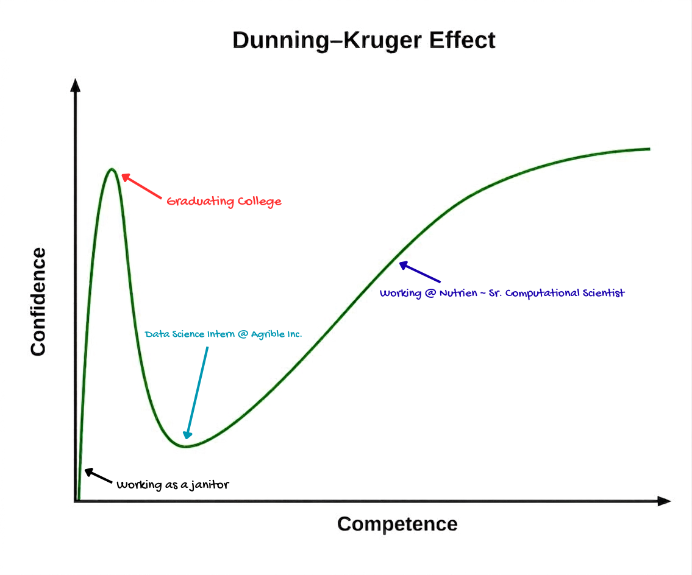

# Data Janitor

### Skills & Competencies
*   **Infrastructure & MLOps:** AWS (Fargate, Batch, S3, EventBridge), Metaflow, Systems Architecture
*   **Data & APIs:** PostgreSQL, PostGIS, gRPC, Protocol Buffers, Zarr
*   **Languages:** Python, C++, Lua, VBA
*   **Core Strengths:** Problem solving, optimization, distributed systems, continuous learning

### Contact Me
* **LinkedIn:** [James Barrett](https://www.linkedin.com/in/james-barrett-36075bb3/)
* **Personal GitHub:** [jbs-public-function](https://github.com/jbs-public-function)
* **Professional GitHub:** [jbagrible](https://github.com/jbagrible)

___

#### The Arc of My Career

*Stay Humble & Never Stop Learning*

---

## How We Got Here

I graduated high school without much direction. I wasn't a particularly good student and college seemed a bridge too far. I wandered from job to job: fry cook, gas station attendant, FedEx Ground package handler. None of these positions were satisfying, but they held the line. Eventually, I got a job with a local janitorial company. For a directionless person, this was a fascinating job. It was clear-cut with clean objectives. The building isn't clean; by the end of your shift, it will be clean. Empty the trash, wipe down desks, squeegee the door glass, clean the bathrooms. Dust. Vacuum. Mop. Done.

I was good at it. It got to a point where I could easily knock out an 8-hour shift in 5-6 hours. I spent a lot of time listening to various podcasts while working, which sparked my latent intellectual curiosity. Wanting more for myself, I enrolled in community college. I had residual math anxiety, so I picked an Associate degree program I felt would have manageable mathematics. My first year, I tested into pre-college algebra. 

I do not know what had changed for me, mentally, between graduating high school with an abysmal GPA and these years at community college. Maybe I had allowed myself to be humble enough to learn, combined with the phenomenal mathematics department of Parkland Community College. I had a Chilean professor who, when talking about various algebraic formulas, would often say in a delightful accent, *"If you want to bomb the village you need the x and the y."* A gruesome example, but it stuck with me.

I spent hours at a time doing every odd problem in my pre-college algebra textbook. Writing and thinking through formulas until my fingers were cramped and my nail beds bled. I drilled and drilled until the basics of algebra became rote. Confidence followed. Graduating with an Associate degree in Business Administration, I transferred to the University of Illinois at Urbana-Champaign. Around this same time, I started playing with the programming language Lua for scripting in Minecraft, as well as learning some VBA for Excel in one of my business courses. I really enjoyed programming as a concept. It was cool that the logic I wrote could execute arbitrary actions. The code was sloppy and amateurish, but it did what I asked it to do.

I knew I wanted to work with computers. My GPA at Parkland was respectable, with a few minor hiccups, but I felt transferring into the CS department at UIUC from Parkland might have been too big a reach—the program is incredibly competitive. I enjoyed economics and felt it would satisfy my intellectual curiosity while teaching me how to work with computing to solve econometric questions. I loaded up on mathematics courses outside the scope of my requirements: discrete mathematics, linear algebra, and calculus. Pushing through registration portals at night, I managed to shoehorn my way into a few core CS courses as well—most notably **CS 225: Data Structures & Algorithms**. This class was the most challenging of my undergraduate career, involving implementing complex data structures in C++ alongside manual memory management.

Throughout this time, I was still a janitor. I worked nights from 5:00 PM to 1:30 AM, Monday through Friday, plus overtime. During the day, I maintained a full-time class schedule from 9:00 AM to 3:00 PM. It was grueling. I had to support myself and my daughter. I pushed myself harder than I ever had before.

Donald Knuth and Big O notation heavily influenced me at this point. I actively applied the concepts of time complexity and efficiency to my cleaning routes. *Is it faster to clean a whole room and then move to the next? Is it more efficient to commit to one task at a time across the entire floor?* I managed to condense my shifting work even further, allowing more time to complete my schoolwork. I would work on calculus problems until I got stuck, and then go clean some more. Walking and cleaning became my pathway to thinking through difficult programmatic problems. To this day, physical movement is how I solve complex architecture bugs.

___

## What Then?

I graduated from the University of Illinois at Urbana-Champaign with a Bachelor of Arts degree in Economics and enough computer science coursework to be a danger to myself. I was still working as a janitor while looking for new opportunities. There were false starts and rejected applications, but they didn't lay me low. I had already jumped into the volcano and survived. 

In 2017, I was hired as a Data Science Intern at Agrible, Inc., an ag-tech startup launched from the incubator at UIUC's Research Park. The exact day I was hired, they laid off half of their staff. Despite the turbulence, I was determined to make the most of the opportunity. I had my foot in the door and was going to leave my mark. I worked under incredible mentors like physicist Brent Trenhaile and engineers Chad Hawkins and Wei Chen. From them, I learned a lot about engineering resilience: every problem has a solution, sometimes you just have to grind harder for it.

I threw myself into the engineering codebase and dedicated myself to upskilling. I learned the ins and outs of the Python ecosystem. Though my title was "Data Science Intern," my actual day-to-day involved fixing, patching, testing, and upgrading production infrastructure. My first major challenge was to refactor an agricultural simulation program from Python 2.7 to Python 3.6. 

This required intense studying of multi-module biophysical models simulating crop growth over time. The model ingested complex data payloads (soil hydrology, seed data, historical weather time-series) to instantiate real-time objects. Naively, I accepted the challenge. In the end, I succeeded in migrating the application and dramatically optimized its core memory usage and time complexity—taking a simulation execution loop that once took a full minute down to just a few seconds. It became faster, cheaper, and fundamentally easier to scale.

The foundational tools I acquired during this period form the core of my stack today: PostgreSQL, PostGIS, Docker containerization, and cloud data primitives. 

In 2018, I was hired full-time at Agrible, Inc. Later that year, we were acquired by Nutrien, Inc.

---

## Nutrien (Data Platform & Infrastructure)

At Nutrien, my engineering focus shifted entirely toward **Infrastructure Engineering, Systems Architecture, and MLOps**. I became responsible for designing systems that manage massive, planetary-scale data streams at every stage of their life cycle. 

My primary engineering milestones here include:
* **Orchestration & Scale:** Implementing **Metaflow** alongside AWS Fargate and AWS Batch to handle heavy computational loads and planetary weather data processing, serving as an internal champion to harden production workflows via AWS State Machines.
* **Storage Architecture:** Effectively utilizing AWS S3 as a high-performance datastore for complex objects and dimensional arrays, specializing in optimized Zarr data stores for massive satellite structures.
* **Event-Driven Distribution:** Transitioning legacy systems from traditional, rigid cron-based schedules to modern, event-driven architectures leveraging **AWS EventBridge** to automatically trigger and safely distribute core datasets organization-wide upon job completion.
* **High-Performance APIs:** Architecting low-latency backend microservices using **gRPC** and Protocol Buffers to efficiently stream multi-terabyte environmental datasets (including NOAA and Sentinel-2 imagery) directly to downstream data science and product teams.

I still approach software development with the mindset of a janitor: looking at chaotic, messy data structures, establishing clear-cut structural logic, and leaving the platform cleaner, faster, and more cost-effective than I found it.
