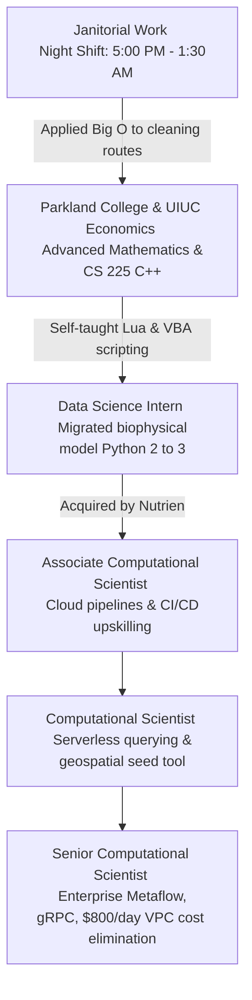

# James Barrett: Senior Computational Scientist & Cloud Infrastructure Engineer

Welcome to my professional repository. I am a systems engineer and cloud infrastructure architect who designs, builds, and optimizes planetary-scale data platforms. 

In the industry, I am known as the **"Data Janitor"**—a title I wear with pride. My engineering philosophy was forged working night shifts as a physical janitor while completing my economics degree and computer science coursework at the University of Illinois at Urbana-Champaign. I believe in establishing clear-cut structural order, automating away manual labor, and leaving every platform cleaner, faster, and more cost-effective than I found it.

---

## 🚀 Key Achievements

*   **VPC Cost Elimination:** Slid department AWS VPC data transfer fees from **$800/day to ~$0/day** (saving over **$280,000/year**) via custom local S3 container caches and internal network routes.
*   **Serverless Modernization:** Re-engineered fragile legacy weather ETL pipelines into serverless AWS Step Functions and AWS Batch state machines, **slashing monthly database and compute costs by 80–90%**.
*   **Distributed APIs:** Architected low-latency **gRPC microservices** using Protocol Buffers to stream multi-terabyte environmental and GIS datasets organization-wide, establishing an enterprise-wide contract-driven single source of truth.
*   **Enterprise MLOps Stack:** Led the end-to-end design, Terraform deployment, and adoption of **Metaflow** on AWS, empowering the data science team to self-serve high-performance compute resources.
*   **Performance Optimization:** Refactored a core, multi-module mechanistic biophysical crop growth simulation from legacy Python 2.7 to Python 3.6, delivering a **10x execution speedup** (reducing loop times from 60 seconds to 5 seconds).

---

## 🛠️ Tech Stack & Specialties

*   **Languages:** Python (Expert), Bash/Shell (Expert), C++, SQL, Lua, VBA
*   **Infrastructure & MLOps:** Terraform, Metaflow, Docker, CircleCI, Apache Airflow, GitHub Actions
*   **AWS Cloud Ecosystem:** Batch, Step Functions, Fargate, S3, RDS, IAM, EventBridge, VPC, Athena, Glue
*   **APIs & Serialization:** gRPC, Protocol Buffers (protobuf v3), REST APIs, JSON
*   **Data & Geospatial:** Postgres/PostGIS, Zarr, Pandas, NumPy, SciPy, Matplotlib

---

## 🗺️ The "Janitor-to-Compiler" Career Arc

My journey from night-shift cleaning routes to senior-level systems architecture has given me a deep appreciation for computational efficiency and a high tolerance for grit. 

  
*Stay Humble & Never Stop Learning*

---

## 📂 Navigation & Repository Map

To maintain a clean separation of concerns, this repository is organized into specific markdown sub-files. Please explore the sections below depending on your focus:

*   **[Print-Ready Chronological Resume (resume.md)](resume.md):** My complete, single-file chronological resume containing contact info, core skills, employment history, featured projects, and education. Ideal for printing or converting directly to PDF.
*   **[Full Executive Narrative (details/background.md)](details/background.md):** The deep-dive personal biography of my career transition, including my core philosophy, study schedules, and how Donald Knuth's *Big O* notation changed how I clean buildings and write systems.
*   **[Chronological Work History (details/experience.md)](details/experience.md):** A detailed, bulleted record of my tenure at Nutrien (and formerly Agrible, Inc.) from my start as an intern to my current role as a Senior Computational Scientist.
*   **[Key Technical Projects (details/projects.md)](details/projects.md):** Standalone deep-dives into my major architectural achievements, mapping the problems, solutions, business impacts, and toolsets of my core work.
*   **[Technical Skills Catalog (details/skills.md)](details/skills.md):** An organized inventory of my software, infrastructure, API, and mathematical capabilities.

---

## 📬 Contact & Connect

If you would like to discuss systems optimization, distributed microservices, or greenfield MLOps deployments, feel free to reach out!

*   **LinkedIn:** [James Barrett](https://www.linkedin.com/in/james-barrett-36075bb3/)
*   **Personal GitHub:** [jbs-public-function](https://github.com/jbs-public-function)
*   **Professional GitHub:** [jbagrible](https://github.com/jbagrible)
